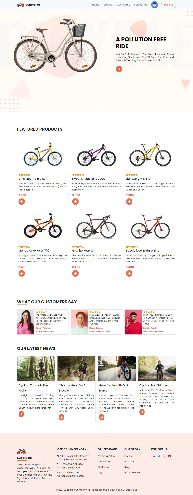
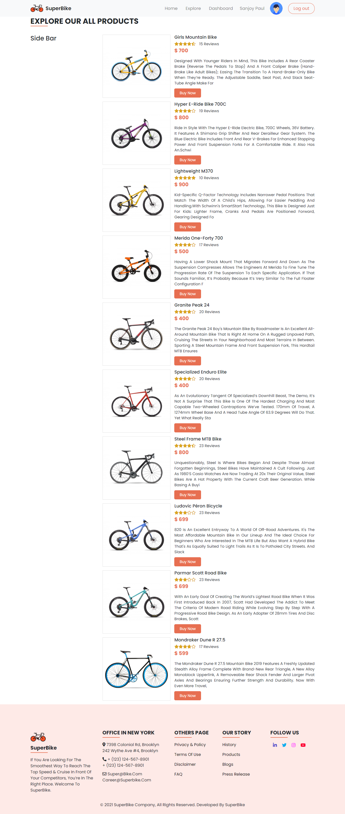
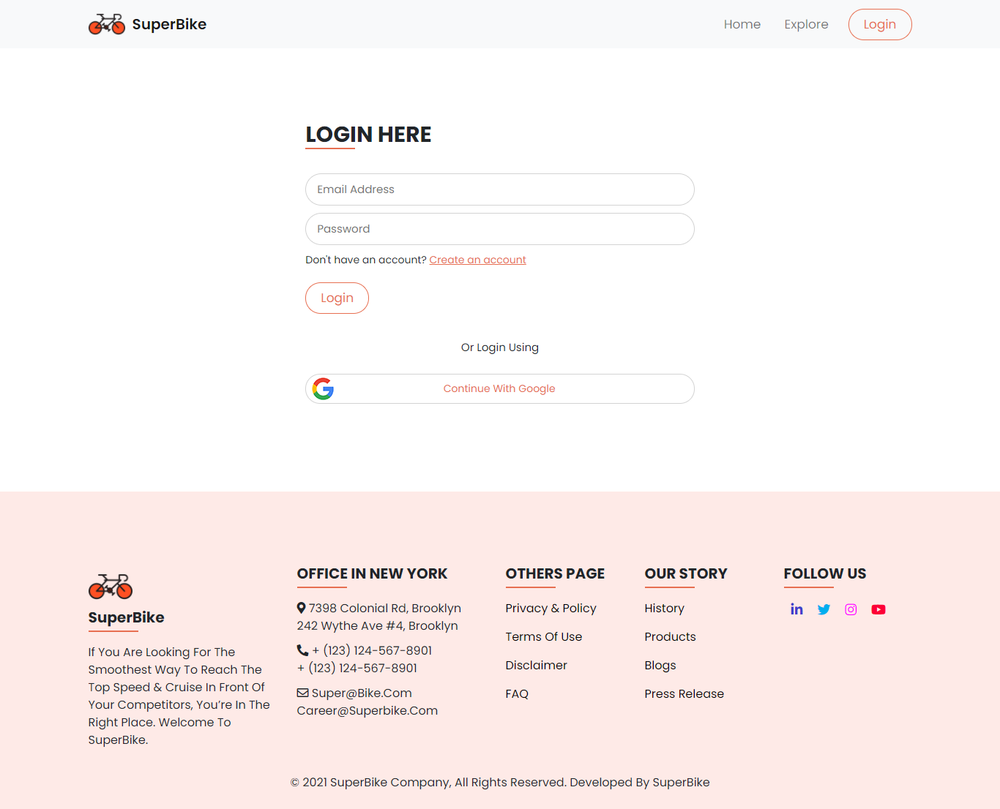
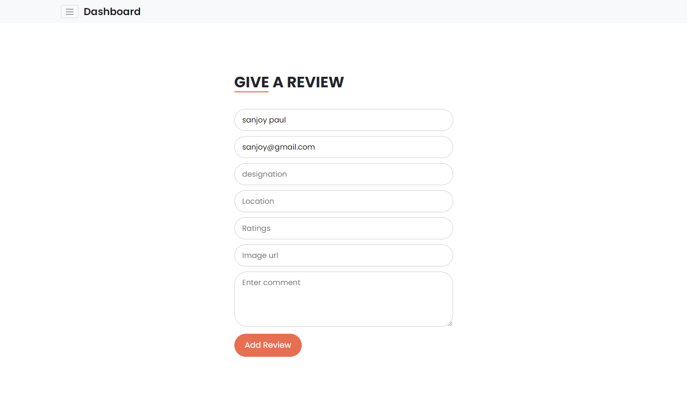
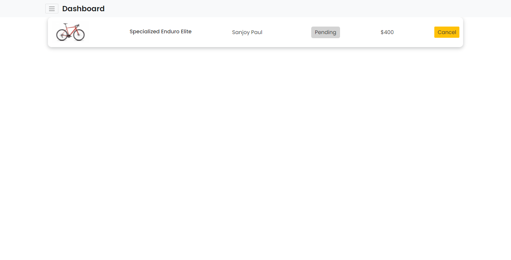
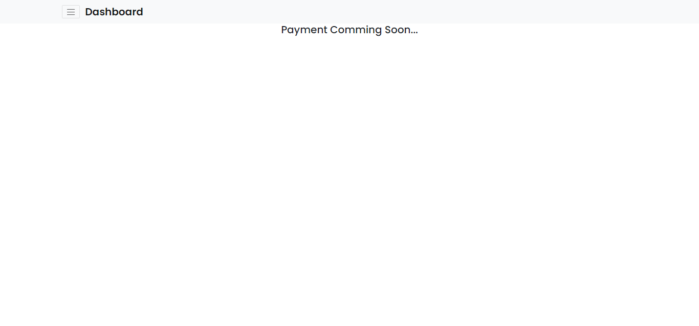
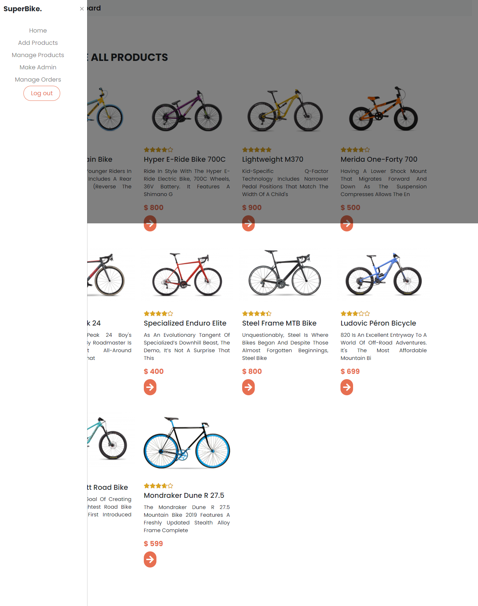
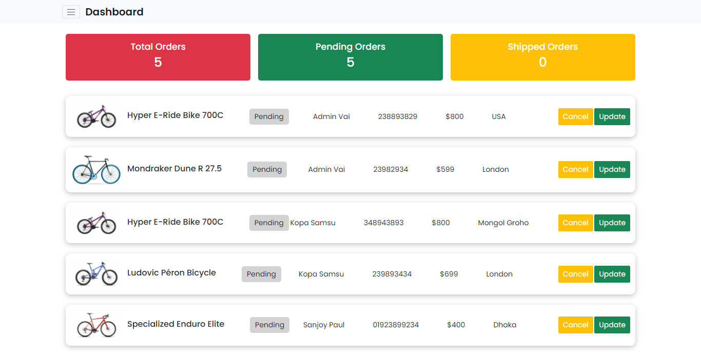
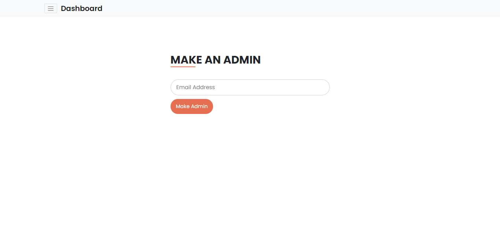
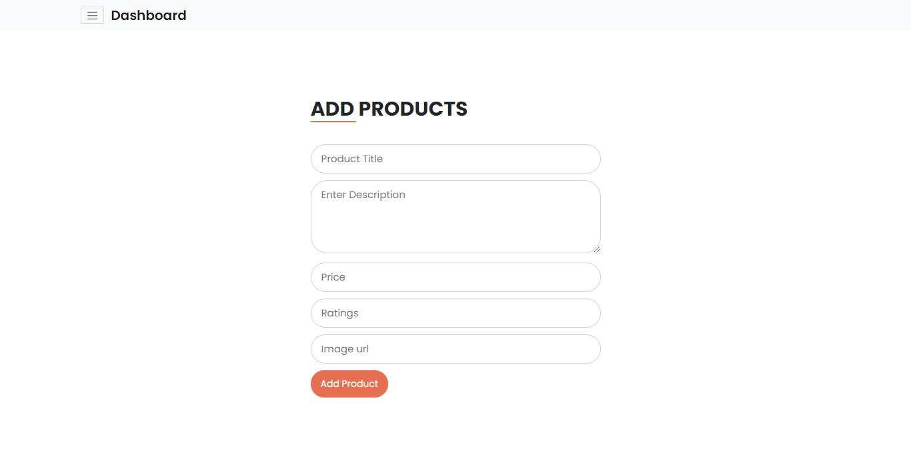

# SuperBike.
## https://super-bike-d3ed8.web.app/home

#### This is just a bicycle selling shop. This site is fully responsive and use react, react-bootstrap, react-hook-form, react-rating, custom css and uses axios to load data from database. Also implement CRUD operation and using MongDb database. Use Heroku to deploy server.

- Implement Firebase authentication specially Email/Password and Google Sign in method. 
- Here, this app's main focus is to implement user dashboard and admin dashboard. 
- Manage Admin, add product, make admin, manage all products, manage all orders services implented here. 
- Also, another site is user dashborad where user show their orders, make reviews, cancel orders.
- Implement delete orders or update orders status and store new products, if Admin wants.

